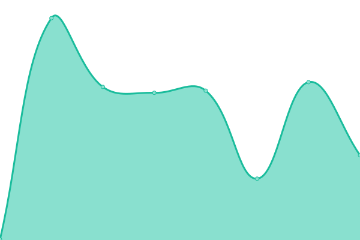

# [📈 Live Status](https://status.dashwave.io): <!--live status--> **🟩 All systems operational**

This repository contains the open-source uptime monitor and status page for [Dashwave](https://dashwave.io), powered by [Upptime](https://github.com/upptime/upptime).

With [Upptime](https://upptime.js.org), you can get your own unlimited and free uptime monitor and status page, powered entirely by a GitHub repository. We use [Issues](https://github.com/dashwave/upptime/issues) as incident reports, [Actions](https://github.com/dashwave/upptime/actions) as uptime monitors, and [Pages](https://status.dashwave.io) for the status page.

<!--start: status pages-->
<!-- This summary is generated by Upptime (https://github.com/upptime/upptime) -->
<!-- Do not edit this manually, your changes will be overwritten -->
<!-- prettier-ignore -->
| URL | Status | History | Response Time | Uptime |
| --- | ------ | ------- | ------------- | ------ |
|  [Console](https://console.dashwave.io) | 🟩 Up | [console.yml](https://github.com/dashwave/upptime/commits/HEAD/history/console.yml) | 

 284ms
     
 | 

<a href="https://status.dashwave.io/history/console">100.00%</a>
    

|  [API](https://api.dashwave.io) | 🟩 Up | [api.yml](https://github.com/dashwave/upptime/commits/HEAD/history/api.yml) | 

 237ms
     
 | 

<a href="https://status.dashwave.io/history/api">100.00%</a>
    

|  [Vault](https://vault.dashwave.io) | 🟩 Up | [vault.yml](https://github.com/dashwave/upptime/commits/HEAD/history/vault.yml) | 

 497ms
     
 | 

<a href="https://status.dashwave.io/history/vault">100.00%</a>
    

|  [Registry](https://registry.dashwave.io) | 🟩 Up | [registry.yml](https://github.com/dashwave/upptime/commits/HEAD/history/registry.yml) | 

 238ms
     
 | 

<a href="https://status.dashwave.io/history/registry">100.00%</a>
    

|  [VPN](https://mysticvpn.dashwave.io) | 🟩 Up | [vpn.yml](https://github.com/dashwave/upptime/commits/HEAD/history/vpn.yml) | 

 349ms
     
 | 

<a href="https://status.dashwave.io/history/vpn">100.00%</a>
    

|  [Vector DB](chromadb-service.dashwave.io) | 🟩 Up | [vector-db.yml](https://github.com/dashwave/upptime/commits/HEAD/history/vector-db.yml) | 

 36ms
     
 | 

<a href="https://status.dashwave.io/history/vector-db">100.00%</a>
    

|  [Minio](minio.dashwave.io) | 🟩 Up | [minio.yml](https://github.com/dashwave/upptime/commits/HEAD/history/minio.yml) | 

 33ms
     
 | 

<a href="https://status.dashwave.io/history/minio">100.00%</a>
    

|  [Compext](https://compext.dashwave.io) | 🟩 Up | [compext.yml](https://github.com/dashwave/upptime/commits/HEAD/history/compext.yml) | 

 226ms
     
 | 

<a href="https://status.dashwave.io/history/compext">100.00%</a>
    

<!--end: status pages-->

[**Visit our status website →**](https://status.dashwave.io)

## 📄 License

- Powered by: [Upptime](https://github.com/upptime/upptime)
- Code: [MIT](./LICENSE) © [Anand Chowdhary](https://anandchowdhary.com), supported by [Pabio](https://pabio.com)
- Data in the `./history` directory: [Open Database License](https://opendatacommons.org/licenses/odbl/1-0/)
